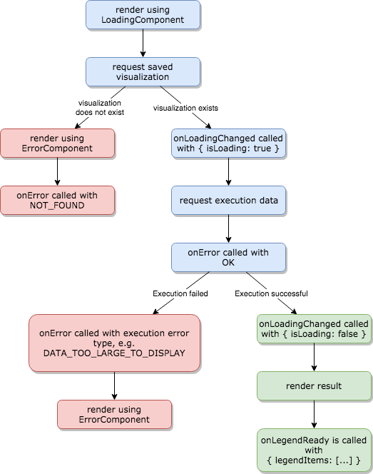

GoodData.UI comes with ready-made visual components listed in the Visual Components section that you can use as-is or further customize. You can also use the unique visualization component that simply renders any chart you create on the GoodData platform.

This article provides components examples and basic usage information to get you going. 

## Responsive UI

Visual Components are responsive by nature and take the whole space of their wrapper element. This behavior implicates that if you want to create a visualization with a specific `height` and `width`, you must specify those dimensions in the wrapper element. Otherwise, the visualization may not be visible.

### Example

```javacsript
<div style={{ height: 400, width: 600 }}>
    <Visualization ... />
</div>
```

## Bucket interface

The props that are used for passing measures and attributes are called buckets. They are similar to the drag&drop buckets in the [Analytical Designer](https://secure.gooddata.com/analyze)). 
Each bucket is a single value or an array of type `IMeasure` or `IVisualizationAttribute`.
It is passed to the component as an object literal.

Review the individual components in the Visual Components section. Comprehensive typings can be found
 [here](https://github.com/gooddata/gooddata-typings/blob/v2.0.0/src/VisualizationObject.ts#L86-L102).

### Example
```js
<div style={{ height: 300 }}>
    <AreaChart
        projectId="myproject"
        measures={[
                      {
                          measure: {
                              localIdentifier: 'm1',
                              definition: {
                                  measureDefinition: {
                                      item: { identifier: 'aagAVA3ffiz' }
                                  }
                              },
                              format: '#,##0'
                          }
                      }
                  ]}
        viewBy={{
                    visualizationAttribute: {
                        displayForm: { uri: '/gdc/md/myproject/obj/851' },
                        localIdentifier: 'month'
                    }
                }}
    />
</div>
```

### How to work with attributes and measures

A measure can be referred to by its `identifier` or `uri`.

Attributes are little different. Each attribute (for example, Date of invoice) has multiple display forms (Years, Quarters etc.). Select a specific display form and place it to a *viewBy* or a similar bucket. However, when you are using attributes in filters, you must refer to the attribute.

To find an identifier or uri of the measure or attributes that you need, download a list of attributes and measures from a GoodData project by using [gdc-catalog-export](gdc-catalog-export.md).

Another option to find identifiers and uris is using the [Analytical Designer](https://secure.gooddata.com/analyze): 

1) Create a visualization that uses measures and attributes that you need.
2) Use your browser's Developer Tools and open the [Network tab](https://developers.google.com/web/tools/chrome-devtools/network-performance/reference#filter). 
3) Find requests to `/executeAfm`. 
4) Search for the [AFM](afm.md) in the request body - it contains the required identifiers to measures, atributes, and display forms. 

> **NOTE:**
> **Object URI vs. object identifier:** Although you can use either object URIs or object identifiers with all visual components, we recommend that you use the **object identifiers**, which are consistent across your domain regardless of the GoodData project they live in. That is, an object used in any project within your domain would have the _same_ object identifier in _any_ of those projects. 

## Visualization lifecycle

Visualization lifecycle is a series events that take place between mounting and rendering a visualization. During this time, a new datasource is created based on the saved visualization identifier or URI. Once its execution is resolved, the result is rendered.

Ad hoc insights, rendered using components like pie chart or table, follow the same lifecycle.

The following component props can be used as lifecycle callbacks:

| Property | Description | Parameters |
| :--- | :--- | :--- |
| onLoadingChanged | A function that is called when a loading state changes | ```{ isLoading: boolean }``` |
| onError | A function that is called when an error state changes | ```{ status: string, ...}``` |
| onLegendReady  | A function that is called when a chart legend is rendered | ```{ legendItems: [...] }``` |

### Visualization Rendered Successfully

If a visualization is successfully rendered, the following events occur:

1. The visualization is mounted and rendered immediately using a ```LoadingComponent```.
2. onLoadingChanged callback is called with a parameter ```{ isLoading: true }```.
3. onError callback is called with a parameter ```{ status: "OK" }```.
4. onLoadingChanged callback is called with a parameter ```{ isLoading: false }```.
5. The visualization is rendered.
6. onLegendReady callback is called with a parameter ```{ legendItems: [...] }```.

### Visualization Failed to Render

If an error is encountered during rendering a visualization (for example, too much data to display), the following events occur:

1. The visualization is mounted and rendered immediately using a ```LoadingComponent```.
2. onLoadingChanged callback is called with a parameter ```{ isLoading: true }```.
3. onError callback is called with a parameter ```{ status: "OK" }```.
4. onLoadingChanged callback is called with a parameter ```{ isLoading: false }```.
5. onError callback is called with the following parameter:
```json
{
    "status": "DATA_TOO_LARGE_TO_DISPLAY",
    "options": {
        "dateOptionsDisabled": false
    }
}
```
6. The visualization is rerendered using an ```ErrorComponent```.

### Flow Chart


<!-- https://drive.google.com/open?id=1sNjUcs9s0SOn68lIvVtIE3-edw6EMiY_ -->
